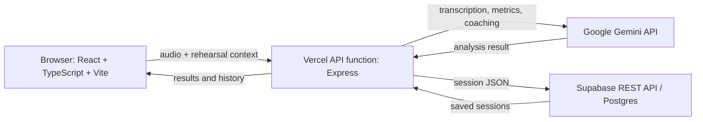

# Cadence technical guide

## Project summary

Cadence is a speech and presentation rehearsal app for students and job seekers. A speaker records or uploads a practice talk, receives a transcript and delivery feedback, then reviews the session and practices targeted drills.

**Live demo:** https://cadenceproject.vercel.app/

**Pitch materials:** [One-page abstract](docs/Cadence_Abstract.pdf) · [Ten-slide pitch deck](docs/Cadence_Pitch_10_Slides.pptx)

## Architecture

The API keeps Gemini and Supabase keys on the server. The browser stores a profile ID and a local session cache. The app sends audio to Gemini for analysis but does not save the recording in Supabase.

## Technology

- Frontend: React 19, TypeScript, Vite, Tailwind CSS, Lucide icons
- Backend: Node.js and Express, deployed as a Vercel function
- AI: Google Gemini API through `@google/genai`
- Session database: Supabase Postgres, accessed by the server through Supabase REST
- Hosting: Vercel

## Main APIs

| API | Method and path | Purpose |
|---|---|---|
| Speech analysis | `POST /api/analyze-speech` | Transcribe a recording and return delivery metrics and coaching. |
| Drill feedback | `POST /api/analyze-drill` | Review a practice drill response. |
| Voice coaching | `POST /api/coach-voice` | Generate spoken coaching audio. |
| Load history | `GET /api/sessions?ownerId=<uuid>` | Load sessions for the current browser profile. |
| Save and delete history | `POST /api/sessions`; `DELETE /api/sessions/<sessionId>?ownerId=<uuid>` | Save or delete a session for the current profile. |

## Database

Run [`supabase/schema.sql`](supabase/schema.sql) in the Supabase SQL Editor. It creates `public.cadence_sessions`:

| Column | Type | Use |
|---|---|---|
| `owner_id` | `uuid` | Browser profile identifier. |
| `session_id` | `text` | Rehearsal identifier. |
| `session_data` | `jsonb` | Transcript, metrics, coaching, and rehearsal context. |
| `created_at` | `timestamptz` | Row creation time. |

The primary key is (`owner_id`, `session_id`). Row-level security is enabled; access is granted to `service_role`, which the server uses. The server filters requests by `owner_id`.

## Demo access and privacy

No login is required. Open the live URL and use **Sample Speeches** or start a rehearsal. Cadence creates a random profile ID in that browser. It is a demo profile, not an authenticated account; another browser or device gets a different profile. Do not store sensitive or production data. Clearing browser storage loses the local profile link. Anyone who obtains an owner ID could access that profile through the API, so real sign-in and server-verified authorization are required before production use.

## Run locally

1. Install Node.js, then run `npm ci` in the project root.
2. Copy `.env.example` to `.env`.
3. Set `GEMINI_API_KEY`, `SUPABASE_URL`, and `SUPABASE_SERVICE_ROLE_KEY` in `.env`.
4. Run `npm run dev` and open the local URL printed by the app.
5. Allow microphone access, or use the audio upload control.

Keep `.env` out of Git. Never put the Supabase service role key in a `VITE_*` variable or browser code. If Supabase is not configured, cloud history is unavailable. Gemini-powered features require a valid API key and available model quota.

## Deploy on Vercel

The Vercel project uses the repository root, runs `npm run build`, and serves the Vite output from `public`. Add `GEMINI_API_KEY`, `SUPABASE_URL`, and `SUPABASE_SERVICE_ROLE_KEY` as Vercel environment variables for Production, then deploy. Redeploy after changing environment variables.

## Readiness checks

- TypeScript check: `npm run lint` — passed October 7, 2026.
- Production frontend build: `npm run build` — passed October 7, 2026.
- Production history CRUD smoke check: save returned HTTP 204, load returned the session, delete returned HTTP 204, and reload confirmed it was absent on October 7, 2026.
- Production AI smoke checks: synthetic speech returned the expected 19-word transcript, and drill feedback returned HTTP 200 on October 7, 2026.
- Pitch materials: one-page abstract and ten-slide deck prepared against the October 8 brief; it includes two labeled production UI screenshots and covers the problem, demo flows, architecture, APIs, reliability changes, and next steps.
- Before the October 8 pitch: complete one real microphone recording and verify the session history on a phone. Synthetic audio and API checks do not prove browser microphone permissions work end to end.
